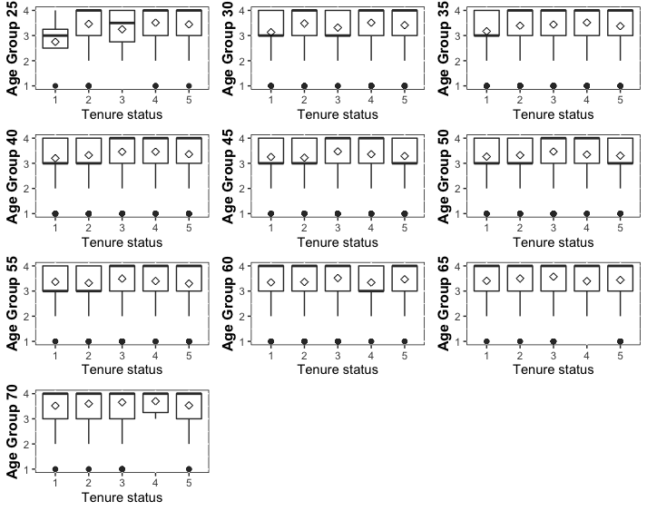

# Abstract of the work:
This code plots multiple Boxplots within one graph. Each Boxplot is stored in a list and then autometically put together in one plot. It shows the dependence between tenure status and the degree of satisfaction with intellectual challenge by different age groups. We also plot the arithmetic mean as a additional measurement. 

