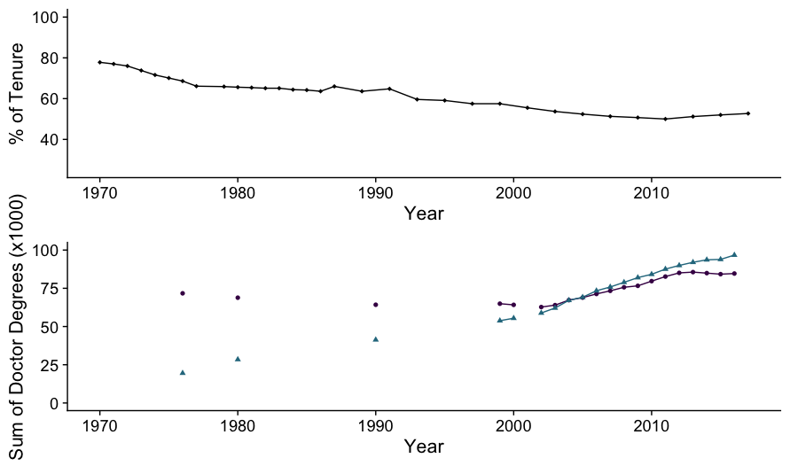

# Abstract of the work:

Shows a time series of the percentage of tenure positions for U.S. institutional organizations (universities, collages). 
It also includes the amount of doctorate holders over time.

